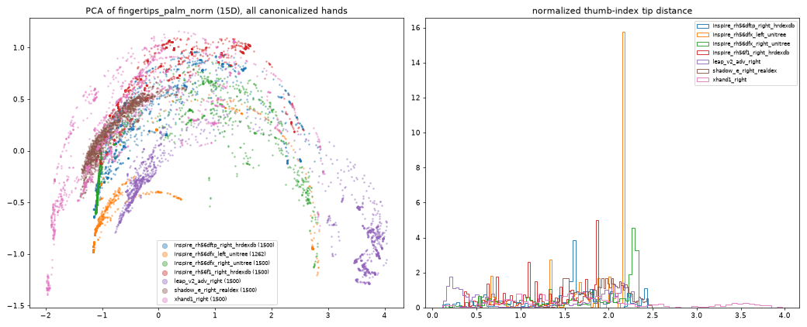

# UnifiedDex — conversion report (sample corpus)

Generated by `python -m unidex.report`. Canonical representation: 5 fingertips in the hand's own palm frame (`fingertips_palm_m`, `fingertips_palm_norm`), order thumb, index, middle, ring, pinky.

Strict policy (config/verification.yaml): geometry is stored ONLY for fully verified (dataset, hand) pairs (V1 exact model, V2 official mapping, V3 measured state, V4 visual check, V5 joint limits, V6 timestamps). Everything else keeps native data only.

## 1. VERIFIED — canonical geometry stored

| dataset | hand | hand_model_id | model_status | state_source | episodes | samples | reason |
|---|---|---|---|---|---|---|---|
| realdex | shadow_dexterous_hand_e/right | shadow_e_right_realdex | dataset_author_model | measured_joint | 9 | 16179 |  |
| humanoid_everyday_h1 | inspire_rh56dfx/right | inspire_rh56dfx_right_unitree | integrator_official | measured_actuator | 20 | 7108 | Unitree (robot integrator) URDF + Unitree normalization; H1 hand = RH56DFX per Unitree DFX_inspire_service |
| humanoid_everyday_h1 | inspire_rh56dfx/left | inspire_rh56dfx_left_unitree | integrator_official | measured_actuator | 3 | 1262 |  |
| hrdexdb | inspire_rh56f1/right | inspire_rh56f1_right_hrdexdb | dataset_author_model | measured_actuator | 68 | 70165 |  |

## 2. EXCLUDED — model and mapping exist, but not 100% verified (native data only)

| dataset | hand | hand_model_id | model_status | state_source | verification | failed_checks | episodes | samples | reason |
|---|---|---|---|---|---|---|---|---|---|
| hrdexdb | inspire_rh56dftp/right | inspire_rh56dftp_right_hrdexdb | dataset_author_model | measured_actuator | excluded | V5 | 10 | 13775 | authors' thumb-rotation conversion reaches 1.40 rad but their URDF limit is 1.15 rad (16% of samples): conversion and model are inconsistent, the thumb-yaw scale of every frame is in doubt. Re-include once resolved (e.g. confirmation from the HRDexDB authors). |
| vitra_teledata | xhand1/right | xhand1_right | third_party_candidate | measured_joint | excluded | V1 | 20 | 4807 | URDF is third-party (facebookresearch/spider); no official RobotEra XHand1 model found. Re-include with an official model. |
| dexwild_robot | leap_hand_v2_advanced/right | leap_v2_adv_right | exact_official | command | excluded | V3,V5 | 15 | 4941 | only commanded joint targets (IK solution of glove retargeting) are stored; IK ran without joint limits. |
| robomind_tienkung | inspire_rh56dfx/right | inspire_rh56dfx_right_unitree | integrator_official | unknown | excluded | V2,V3,V6 | 16 | 9265 | Unitree normalization applied to RoboMIND data is our assumption (not RoboMIND code); puppet == master bit-identical (state source unknown); no timestamps / recording rate. |
| robomind_tienkung | inspire_rh56dfx/left | inspire_rh56dfx_left_unitree | integrator_official | unknown | excluded | V2,V3,V6 | 16 | 9265 | see robomind_xsens__inspire_rh56dfx_right |

## 2b. NOT PROCESSED — no model / no usable mapping / no data (native data only)

| hand | decision | native_streams_in_dataset |
|---|---|---|
| fourier_actionnet/fourier_fdh6 | NOT PROCESSED (decision 2026-09-23): data are DexHand motor position params (0..~12); no official motor->joint transmission. A candidate linear mapping was rejected as too risky. | 60 |
| fourier_actionnet/fourier_6dof_on_gr2 | NOT PROCESSED: same motor-unit problem, hand variant unconfirmed. | 60 |
| fourier_actionnet/fourier_fdh12 | NOT PROCESSED: no public FDH-12 model. | 60 |
| agibot_world_dexhand/agibot_g1_dexhand | NOT PROCESSED: no public hand model. | 158 |
| robomind_tienkung/inspire_rh56dfx_gello | NOT PROCESSED: 1D closure only. | 42 |
| vitra_teledata/xhand1_left | left arm/hand not present in the released VITRA data | 0 |
| robotacdex/brainco_revo2 | model ready, dataset not public | 0 |

## 3. Sample corpus per dataset

| dataset | episodes | hours | text | annotation_source | cameras_per_ep | cameras_local | depth | tactile | contact_labels | hand_streams | canonical_ok |
|---|---|---|---|---|---|---|---|---|---|---|---|
| agibot_world_dexhand | 79 | 1.526 | 100% | dataset | 8.0 | 0.3 | False | False | False | 158 | 0 |
| dexwild_robot | 15 | 0.046 | 0% | none | 2.0 | 0.3 | False | False | False | 15 | 0 |
| fourier_actionnet | 30 | 0.16 | 40% | dataset,none | 1.0 | 1.0 | False | False | False | 60 | 0 |
| hrdexdb | 78 | 0.481 | 0% | none | 22.9 | 1.8 | False | True | False | 78 | 68 |
| humanoid_everyday_h1 | 20 | 0.066 | 100% | dataset | 1.0 | 1.0 | False | False | False | 40 | 23 |
| realdex | 9 | 0.299 | 0% | none | 4.0 | 4.0 | True | False | True | 9 | 9 |
| robomind_tienkung | 21 | 0.0 | 100% | dataset | 1.0 | 1.0 | True | False | False | 42 | 0 |
| vitra_teledata | 20 | 0.044 | 100% | dataset | 1.0 | 1.0 | False | False | False | 20 | 0 |

## 4. Canonicalization status per hand stream

| dataset_id | side | canonicalization_status | streams |
|---|---|---|---|
| agibot_world_dexhand | left | missing_exact_hand_model | 79 |
| agibot_world_dexhand | right | missing_exact_hand_model | 79 |
| dexwild_robot | right | excluded_not_verified | 15 |
| fourier_actionnet | left | hand_not_used_in_episode | 1 |
| fourier_actionnet | left | missing_exact_hand_model | 12 |
| fourier_actionnet | left | missing_joint_mapping | 17 |
| fourier_actionnet | right | missing_exact_hand_model | 12 |
| fourier_actionnet | right | missing_joint_mapping | 18 |
| hrdexdb | right | excluded_not_verified | 10 |
| hrdexdb | right | ok | 68 |
| humanoid_everyday_h1 | left | hand_not_used_in_episode | 17 |
| humanoid_everyday_h1 | left | ok | 3 |
| humanoid_everyday_h1 | right | ok | 20 |
| realdex | right | ok | 9 |
| robomind_tienkung | left | excluded_not_verified | 16 |
| robomind_tienkung | left | missing_joint_mapping | 5 |
| robomind_tienkung | right | excluded_not_verified | 16 |
| robomind_tienkung | right | missing_joint_mapping | 5 |
| vitra_teledata | right | excluded_not_verified | 20 |

## 5. Cross-embodiment check



```

                                                inspire_rh56dfx_left  inspire_rh56dfx  inspire_rh56f1  shadow_e  median
A raw 15D fingertips (current)                                  1.69             5.25            3.19      2.67    2.93
B 4 fingers only (12D, drop thumb)                              0.34             1.99            3.17      3.40    2.58
C 10 pairwise tip distances                                     0.30             3.44            1.57      1.68    1.62
D 4 fingers + 4 thumb->finger dists                             0.30             3.10            2.65      2.78    2.71
E per-hand URDF-reach normalized 15D                            0.51             1.27            1.48      1.89    1.38
F fingers 12D + thumb reach-normalized                          1.37             4.54            3.53      3.06    3.30
G pairwise dists + 5 extension ratios                           0.58             3.82            2.43      2.20    2.31
H pairwise dists + 4 finger ext (no thumb ext)                  0.30             3.74            1.91      2.19    2.05

```

Decision on the thumb gap and clustering features: GRASP_LABELING.md.

Per-hand visual checks: `unified/validation/*.png` (RGB frame + canonical skeleton at the same timestamp).